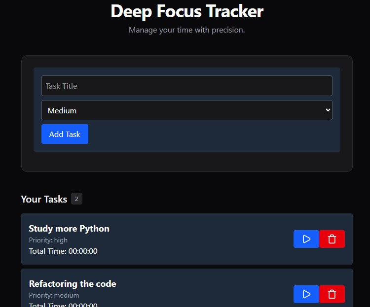

# 🎯 Deep Focus Tracker

Um gerenciador de tarefas focado em produtividade e alta performance, construído com **React**, **TypeScript** e **Tailwind CSS**. Este projeto utiliza o conceito de **Documentation Driven Development (DDD)** e arquitetura modular de Hooks.

---

## 🚀 Sobre o Projeto

O **Deep Focus Tracker** foi desenvolvido para ajudar desenvolvedores a monitorarem o tempo real investido em cada tarefa, combatendo a procrastinação através de um feedback visual imediato.

Este repositório é o resultado de um estudo focado em:

- **Ambiente Moderno:** Vite + React 19 + Tailwind CSS v4.
- **Arquitetura Limpa:** Separação estrita entre lógica de negócio (Custom Hooks) e interface (Componentes).
- **Tipagem Avançada:** Uso de interfaces TypeScript para garantir contratos de dados sólidos.
- **Persistência Local:** Gerenciamento de estado sincronizado com LocalStorage.

## 🛠️ Tecnologias Utilizadas

- [React](https://reactjs.org/) - UI Library
- [TypeScript](https://www.typescriptlang.org/) - Superset de JavaScript com tipagem estrita.
- [Tailwind CSS](https://tailwindcss.com/) - Estilização utilitária de alta performance.
- [Lucide React](https://lucide.dev/) - Conjunto de ícones minimalistas.
- [Vite](https://vitejs.dev/) - Ferramenta de build e dev server ultra-rápido.

## 🏗️ Arquitetura e Organização

O projeto segue uma estrutura pensada em escalabilidade:

```text
src/
├── components/     # Componentes de UI reutilizáveis (Atomic Design)
├── features/       # Componentes funcionais e lógicas de tela
├── hooks/          # Onde reside a inteligência (useTasks, useTimer)
├── types/          # Contratos e interfaces (SSOT - Single Source of Truth)
└── utils/          # Funções utilitárias (formatação de tempo, etc)
```

## 📖 Documentação e Planejamento (Design First)

Diferente de projetos convencionais de estudo, este repositório segue a metodologia **Design First**. Antes de escrever a primeira linha de código, a estrutura foi planejada e documentada na pasta [`/docs`](./docs), servindo como bússola para o desenvolvimento assistido por IA:

- **[01-PRD.md](./docs/01-prd.md):** Documento de Requisitos do Produto. Define o "porquê" e o "o quê" do projeto, listando as funcionalidades essenciais e o público-alvo.
- **[02-ARCH.md](./docs/02-arch.md):** Definição da Arquitetura. Estabelece o uso de Clean Architecture, Custom Hooks para lógica de negócio e o padrão de estilização com Tailwind CSS.
- **[03-CONTEXT.md](./docs/03-context.md):** Guia de Contexto e Estilo de Código. Define as regras de desenvolvimento (Sênior Patterns), garantindo consistência e manutenibilidade.

Essa abordagem permitiu um ciclo de desenvolvimento extremamente ágil e seguro, minimizando débitos técnicos e garantindo que cada componente cumpra seu papel dentro do ecossistema do app.

## 🧠 Aprendizados e Desafios

Durante o desenvolvimento, foquei em resolver desafios reais de engenharia:

Memory Leak Prevention: Implementação de limpeza de intervalos de tempo (clearInterval) para evitar vazamento de memória.

Persistence Logic: Sincronização eficiente entre o estado do React e a API do LocalStorage.

Type-Safe Imports: Adaptação às novas regras de import type do TypeScript moderno para otimização de bundle.

🔧 Como Rodar o Projeto
Clone o repositório:

```bash
git clone [https://github.com/SEU_USUARIO/deep-focus-tracker.git](https://github.com/SEU_USUARIO/deep-focus-tracker.git)
```

Instale as dependências:

```bash
npm install
```

Inicie o servidor de desenvolvimento:

```bash
npm run dev
```

Desenvolvido com foco em estudo de AI-Assisted Development utilizando o ecossistema Google Gemini e OpenAI.


